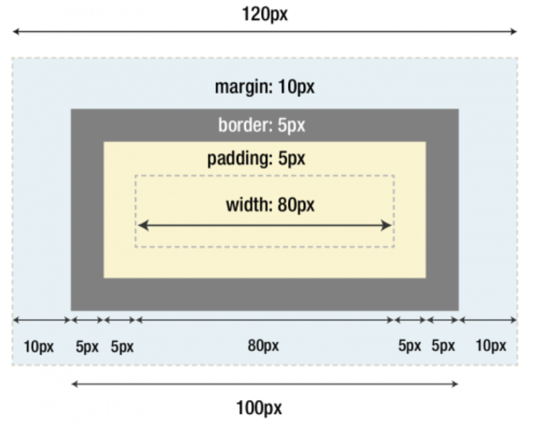

# CSS
## 1. Cómo añadimos CSS en nuestro html
```css
//importamos en el head del html
<link rel="stylesheet" href="main.css">

// dentro del css
body {
    margin: 0;
}
```
<br>

En el html podemos ponerlo en uso de dos formas:
```html
//etiqueta style
<style>
body {
  background-color: #FF00FF;
}
 
h1 {
  color: #FE56A2;
  margin-left: 40px;
}
</style>

//atributo
<h1 style="color:blue;text-align:center;">This is a heading</h1>
```

---
<br>

## 2. Selectores
por preferencia:
- **_STYLE_**: en el html, directo.

- **_ID_**: casos concretos. 

- **_CLASS_**: objetos generales.

- **_STYLE_**: en general.
<br>

en html: 
```html
<p style="color:red" id="parrafo" class="c-parrafo">Hola</p>
```
<br>

en css:
```css
// general
* {
    margin: 0;
}

// id
#parrafo {
    color: red;
}

.c-parrafo {
    background-color: red;
}
//
```

---
<br>

## 3. Modelo de caja
- **_WIDTH_**: ancho del elemento.

- **_PADDING_**: espacio entre el contenid del elemento y su borde (relleno).

- **_MARGIN_**: espacio exterior alrededor del elemento

- **_BORDER_**: el borde del elemento
<br>

```css
.mi_caja {
  width: 80px;
  padding: 5px;
  border: 5px solid red;
  margin: 10px;
}
```
<br>



---
<br>

## 4. Display
Define como se comporta visualmente los elementos de una página.
<br>

Tipos comunes:
- **_INLINE:_** para un elemento que forma parte de un párrafo.

- **_INLINE-BLOCK:_** como _inline_ pero permite especificar el ancho y alto.

- **_BLOCK:_** especifica ancho y alto. genera salto de línea
<br>

```css
.destacar {
    display: block;
}
```
---
<br>

### Display : none y visibility : hidden
- **_DISPLAY:NONE:_** hace desaparecer el elemento como si no existiera.

- **_VISIBILITY:HIDDEN:_** el elemento es invisible pero ocupa su hueco.

---
<br>

## 5. &nbsp
Representa un espacio en blanco no separable
<br>

```html
<body>
  <!-- Aquí los espacios serán colapsados -->
  <p>Esto    es    un    ejemplo    con    espacios    regulares.</p>

  <!-- Aquí los espacios se mantienen -->
  <p>Esto&nbsp;&nbsp;&nbsp;es&nbsp;&nbsp;&nbsp;un&nbsp;&nbsp;&nbsp;ejemplo&nbsp;&nbsp;&nbsp;con&nbsp;&nbsp;&nbsp;espacios&nbsp;&nbsp;&nbsp;no&nbsp;&nbsp;&nbsp;colapsados.</p>
</body>
```

---
<br>

## 6. Sombras
Usamos el box-shadow para dar sensación de profundidad sin necesidades de bordes.
<br>

```css
.sombra {
    box-shadow: 0 1px 3px hsla(0, 0%, .2);
}
```

---
<br>


