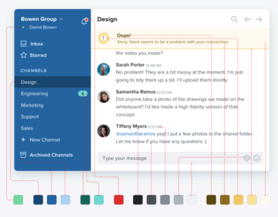
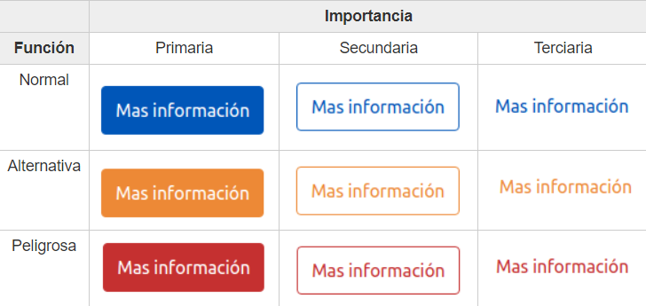

# DISEÑO WEB
## 1. Normas y estilos de diseño

- resaltar lo importante

- destacar importante **=** + llamativo y fácil

- no usar los títulos necesariamente para llamar la atención

- esquinas cuadradas = seriedad **/** esquinas redondas = informal

- evitar usar label o captions, no indicar correos cuando lo son, ni que use un formato por defecto

- cosas no relacionadas que estén separadas entre si

## 2. Colores

dos colores:
 
principal y secundario

- jugar con colores que hagan contrastes

- cosas encima -> **_+ claras_** que las de abajo

## 3. Botones

tienen dos características:

**IMPORTANCIA:**
 
cuanta intención tenemos de que el usuario quiera pulsar el botón

**FUNCIÓN:**
 
avisar al usuario que tipo de acción está realizando

## 4. Sistema de tamaños
- padding o margin (px)

- tamaño de fuente (px)

- border radius (px)